<div align="center">

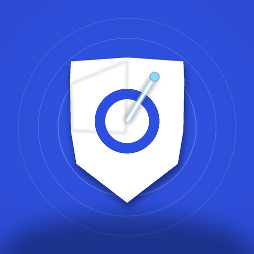

# ScamRadar

### AI Scam & Phishing Detector

**Paste it. Check it. Don't get scammed.**

[](https://developer.android.com)
[](https://kotlinlang.org)
[](LICENSE)
[](https://github.com/chartmann1590/ScamRadar/releases/latest)

[Download APK](https://github.com/chartmann1590/ScamRadar/releases/latest) · [Download AAB](https://github.com/chartmann1590/ScamRadar/releases/latest) · Google Play coming soon

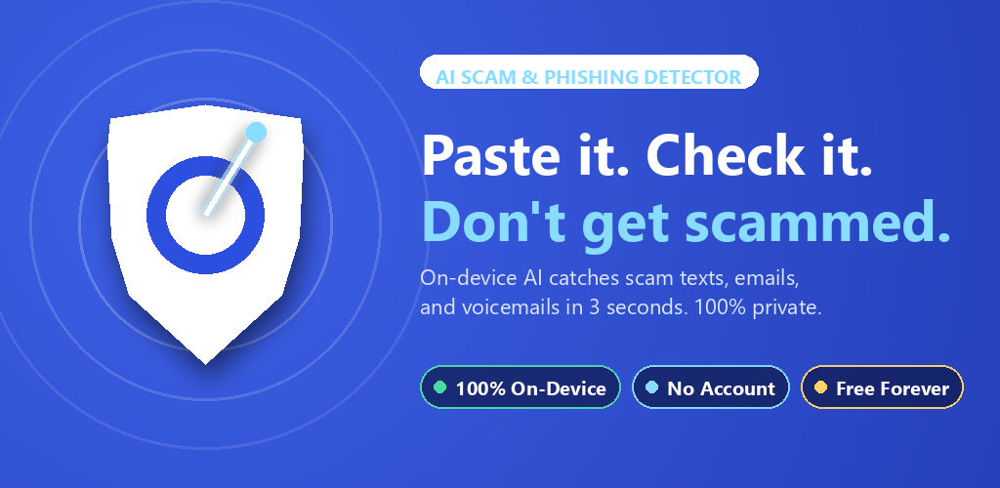

### Watch the 40-second demo

[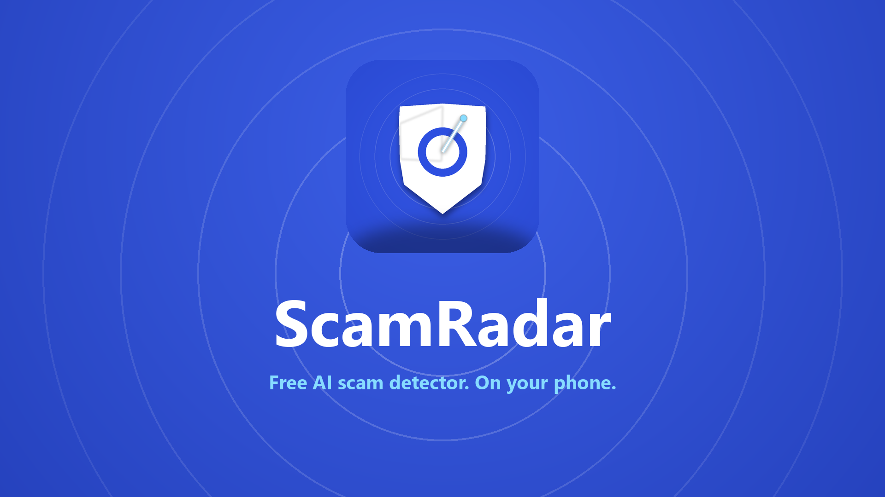](https://chartmann1590.github.io/ScamRadar/#watch)

> [Watch the video on the website](https://chartmann1590.github.io/ScamRadar/#watch) · [Download the MP4](play-store/video/scamradar_promo.mp4) · [Captions (.srt)](play-store/video/scamradar_promo.srt)

</div>

---

## What is ScamRadar?

ScamRadar is a **free Android app** that tells you in 3 seconds whether a suspicious text message, email, or voicemail is a scam — and explains **exactly why**.

AI-generated scams surged **1,210% in 2025**. Deepfake voice phishing is up **1,633%**. Humans now detect AI deepfakes at less than **30% accuracy**. You need a second opinion that's faster than you.

### Why ScamRadar is Different

| Feature | ScamRadar | Competitors |
|---------|-----------|-------------|
| **100% On-Device** | Your messages never leave your phone | Cloud-based analysis |
| **No Account Required** | Open, paste, get an answer | Sign-up walls & trials |
| **Free Forever** | Core scanner is always free | Subscription-gated |
| **AI-Scam Specialist** | Built for the new wave of AI scams | Retrofitted spam filters |
| **Explains Why** | Highlights exact red-flag phrases | Binary safe/unsafe only |

---

## Features

### Text Scan
Paste any suspicious message and get an instant verdict: **Safe**, **Suspicious**, or **Likely Scam** — with a confidence score and highlighted red-flag phrases.

### Email Screenshot Scan
Share a screenshot of a suspicious email. Built-in OCR extracts the text and runs it through the same scam classifier.

### Voicemail Scan
Import or record a voicemail. On-device speech recognition transcribes the audio and flags voice-cloning indicators.

### Scam Library
Browse the 12 most common scam patterns of 2026 with real annotated examples. Learn to spot scams on your own.

### Scan History
Your last 50 scans, stored locally on your device. Delete anytime. Never synced anywhere.

### Share Verdict Card
One-tap export of a verdict card as an image — perfect for warning family and friends in group chats.

---

## How It Works

```
1. Paste   →  Paste a suspicious text, share a screenshot, or import a voicemail
2. Check   →  On-device AI (Gemma 4) analyzes the content privately on your phone
3. Verdict →  Get a clear verdict with highlighted red flags and recommended actions
```

**Your messages never leave your phone.** We literally cannot read what you paste, because we never receive it.

---

## Technical Details

| Component | Technology |
|-----------|-----------|
| Language | Kotlin |
| UI | Jetpack Compose + Material 3 |
| On-Device AI | Gemma 4 E2B-it via LiteRT-LM |
| OCR | ML Kit Text Recognition v2 |
| Speech-to-Text | Android SpeechRecognizer (on-device) |
| Storage | Room + DataStore |
| Analytics | Firebase Analytics (anonymous only) |
| Ads | Google AdMob |
| Backend | **None** — this is the moat |

### ScamRadar Lite

On devices with less than 4 GB RAM, or before the AI model finishes downloading, ScamRadar runs in **Lite mode** — a fast heuristic classifier that uses regex, keyword matching, and URL reputation against 5,000+ known scam patterns. Still 100% private, still free, no download required.

---

## Screenshots

Captured live on a Pixel 8 Pro running the actual app.

<div align="center">

| Paste it. Check it. | On-device. Private. | Clear verdict. | What to do next. |
|---------------------|---------------------|----------------|------------------|
| 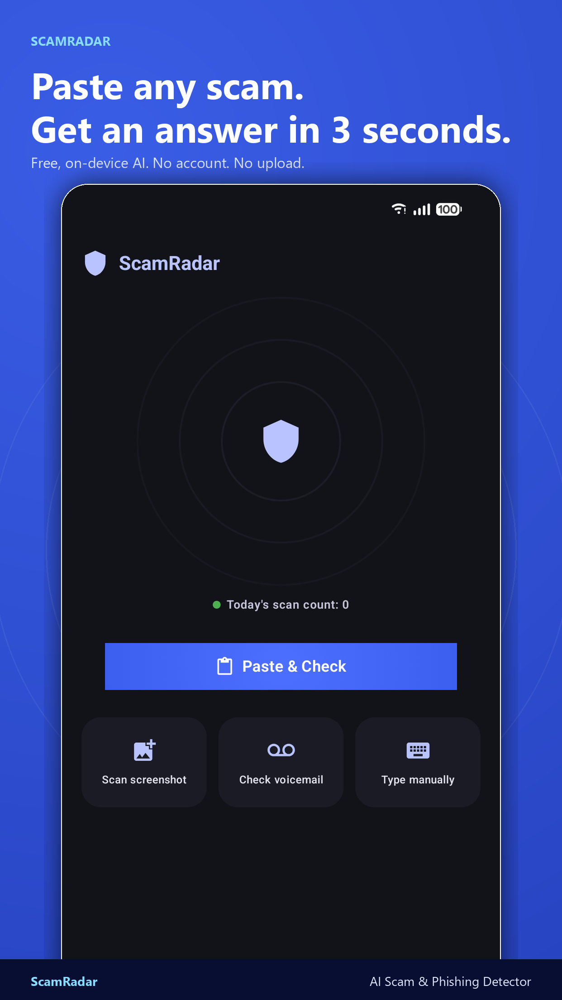 | 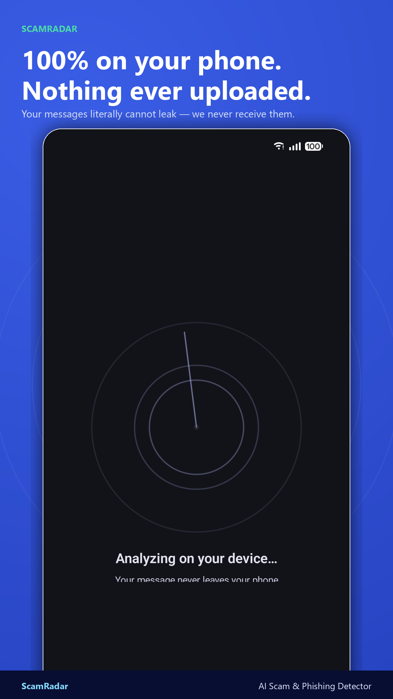 | 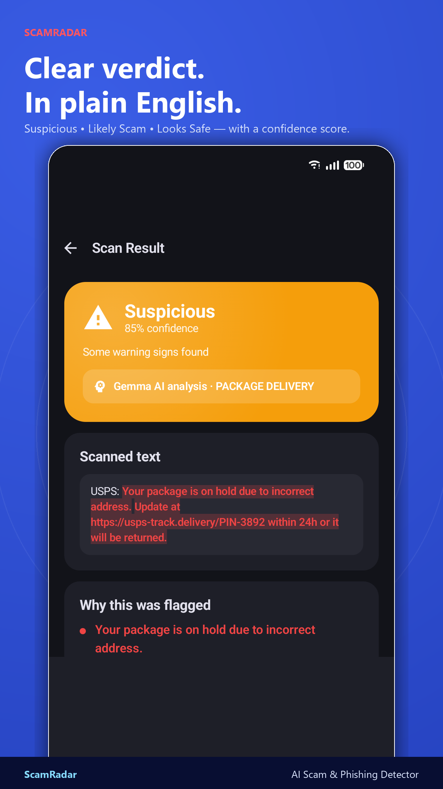 | 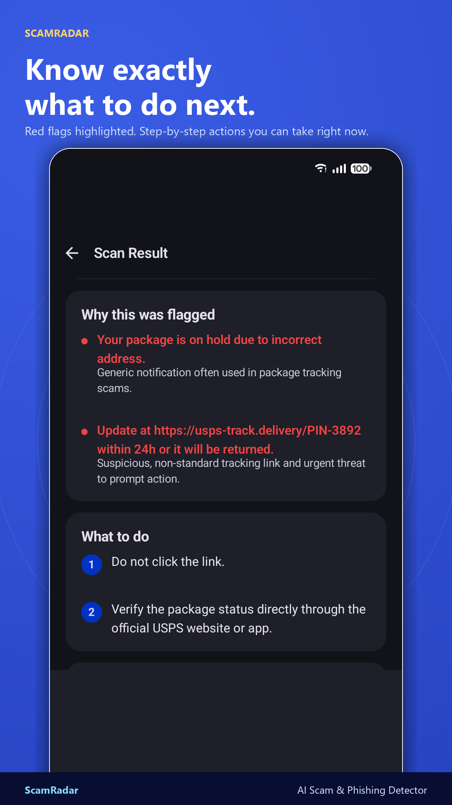 |

| Peace of mind. | Learn the patterns. | Track your scans. | Free. Offline. |
|----------------|---------------------|-------------------|----------------|
| 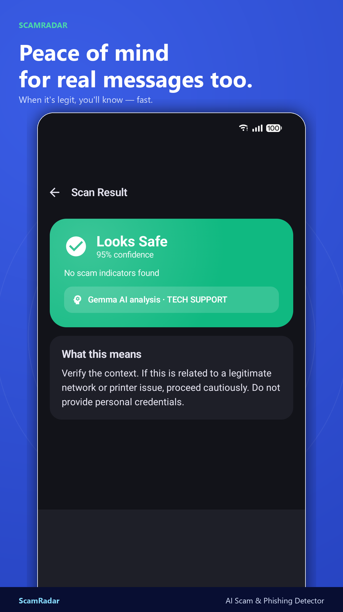 | 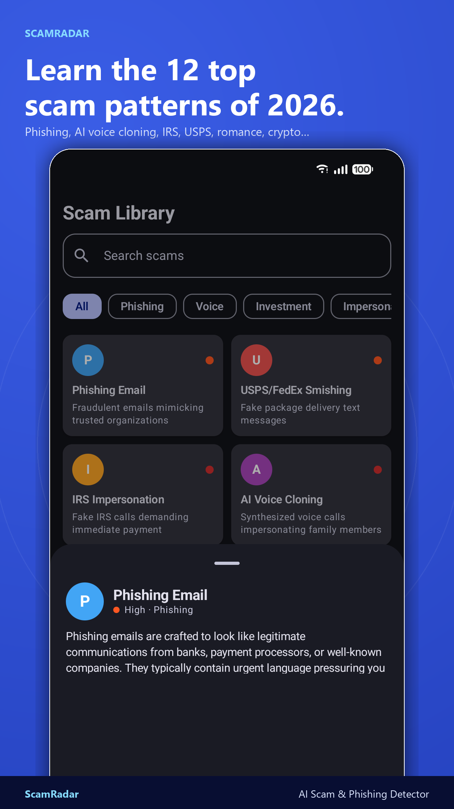 | 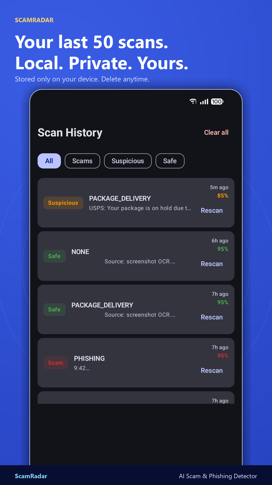 | 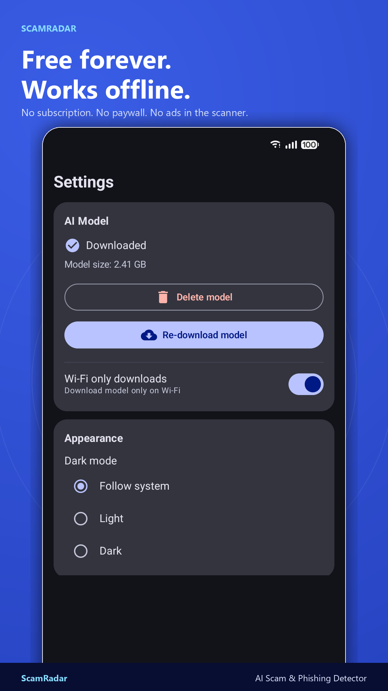 |

</div>

> Want the unframed device captures? See [`play-store/screenshots/raw/`](play-store/screenshots/raw/). Tablet sizes for the Play Store live alongside in [`tablet-7in/`](play-store/screenshots/tablet-7in/) and [`tablet-10in/`](play-store/screenshots/tablet-10in/).

---

## Privacy

ScamRadar is built with privacy as a core principle:

- **No cloud processing** — all analysis happens on your device
- **No account needed** — we don't collect emails or personal info
- **No message logging** — scan content is never sent to any server
- **Local history only** — stored on-device, deletable, never synced
- **Anonymous analytics** — only app interaction events (no message content)

See our full [Privacy Policy](PRIVACY_POLICY.md).

---

## Building from Source

### Requirements

- Android Studio Hedgehog or later
- Android SDK with API 35 (Android 15)
- Min SDK 26 (Android 8.0)
- Kotlin 2.0+

### Setup

```bash
git clone https://github.com/chartmann1590/ScamRadar.git
cd ScamRadar
```

Open the project in Android Studio and run on a device or emulator.

> **Note:** The AI model (Gemma 4 E2B-it, ~3.1 GB) is downloaded on first run, not bundled in the APK. The app works immediately in Lite mode before the download completes.

---

## Project Structure

```
app/src/main/java/com/scamradar/app/
├── classifier/          # Scam classification (Gemma + Lite heuristic)
├── data/                # Room DB, DataStore, models
├── download/            # Model download service & manager
├── ocr/                 # ML Kit OCR processing
├── speech/              # On-device speech recognition
└── ui/
    ├── components/      # Shared UI components
    ├── navigation/      # Nav graph & screen definitions
    ├── screens/         # Home, Result, Library, History, Settings, Onboarding
    └── theme/           # Material 3 theme, colors, shapes, typography
```

---

## Who is ScamRadar For?

- Anyone who gets weird texts and wants a second opinion
- Adult children helping older parents stay safe online
- Small business owners who receive fake invoice emails
- Anyone whose phone is buzzing with USPS/Amazon/IRS/"your bank" texts

---

## Support ScamRadar

If ScamRadar has helped you or someone you care about, consider buying me a coffee:

[](https://www.buymeacoffee.com/charleshartmann)

---

## License

This project is licensed under the MIT License — see the [LICENSE](LICENSE) file for details.

---

<div align="center">

**Don't get scammed. Get ScamRadar.**

[Download](https://github.com/chartmann1590/ScamRadar/releases/latest) · [Website](https://chartmann1590.github.io/ScamRadar/) · [Privacy Policy](https://chartmann1590.github.io/ScamRadar/privacy) · [Report a Bug](https://github.com/chartmann1590/ScamRadar/issues) · [Support &#x2615;](https://www.buymeacoffee.com/charleshartmann)

</div>
